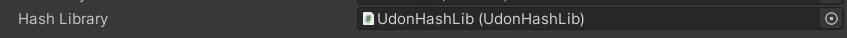

***

<h1 align="center">
<sub>
    
</sub>
</h1>
<p align="center">
<sup>
a UTF-8 RFC-compliant cryptographic hashing library for Udon
</sup>
<br>
<sup>
    <a href="https://vrchat.com/home/world/wrld_22df9df2-480f-4203-92a0-90835402e5eb">See it in VRChat</a>
</sup>
</p>

***


<sup>
You can copy <code>UdonHashLib サイコー</code> into <a href="https://www.browserling.com/tools/all-hashes">here</a> to check these hashes.
</sup>
<br>
<br>

## Supported hash algorithms

<table>
<thead>
  <tr>
    <th>Algorithm</th>
    <th>Variant</th>
    <th>Supported</th>
  </tr>
</thead>
<tbody>
  <tr>
    <td>MD</td>
    <td>MD5</td>
    <td>✅</td>
  </tr>
  <tr>
    <td>SHA1</td>
    <td>SHA1</td>
    <td>✅</td>
  </tr>
  <tr>
    <td rowspan="6">SHA2</td>
    <td>SHA224</td>
    <td>✅</td>
  </tr>
  <tr>
    <td>SHA256</td>
    <td>✅</td>
  </tr>
  <tr>
    <td>SHA384</td>
    <td>✅</td>
  </tr>
  <tr>
    <td>SHA512</td>
    <td>✅</td>
  </tr>
  <tr>
    <td>SHA512/224</td>
    <td>❌</td>
  </tr>
  <tr>
    <td>SHA512/256</td>
    <td>❌</td>
  </tr>
  <tr>
    <td rowspan="6">SHA3</td>
    <td>SHA3-224</td>
    <td>❌</td>
  </tr>
  <tr>
    <td>SHA3-256</td>
    <td>❌</td>
  </tr>
  <tr>
    <td>SHA3-384</td>
    <td>❌</td>
  </tr>
  <tr>
    <td>SHA3-512</td>
    <td>❌</td>
  </tr>
  <tr>
    <td>SHAKE128</td>
    <td>❌</td>
  </tr>
  <tr>
    <td>SHAKE256</td>
    <td>❌</td>
  </tr>
</tbody>
</table>

## How to use

Download the latest release from the [releases](https://github.com/Gorialis/vrchat-udon-hashlib/releases) page.

You need the latest [VRCSDK3-WORLD](https://vrchat.com/home/download) and a copy of [UdonSharp](https://github.com/MerlinVR/UdonSharp/releases).

To use the library in your scene, either drag an instance of the UdonHashLib prefab into the scene, or add the `UdonBehaviour` component to an existing object and give it the `UdonHashLib` program source.

**You only need to have one instance of UdonHashLib in your world. The library object is stateless, and so it is safe for multiple behaviors or objects to use it at once.**

Once it is in your scene, you must add a field to your behavior to reference the library, like so:

```csharp
[SerializeField]
private UdonHashLib _hashLibrary;
```

Make sure you set the field to reference the UdonHashLib prefab, or whichever object holds the program:



You can then use the library from that behavior as described below.

## API reference

<table>
<thead>
  <tr>
    <th>Function</th>
    <th>Description</th>
  </tr>
</thead>
<tbody>
  <tr>
    <td><code><i>_hashLibrary.</i>MD5_Bytes(byte[] data) -&gt; string</code></td>
    <td rowspan="2">
        Taking in either an array of bytes or a string (which will be interpreted as UTF-8), this function returns the MD5 hash as hexadecimal.
        <br><br>
        <b>Please note that the MD5 algorithm is known to have collisions. For real security purposes, it is recommended to use a newer algorithm.</b>
    </td>
  </tr>
  <tr>
    <td><code><i>_hashLibrary.</i>MD5_UTF8(string text) -&gt; string</code></td>
    <td></td>
  </tr>
  <tr>
    <td><code><i>_hashLibrary.</i>SHA1_Bytes(byte[] data) -&gt; string</code></td>
    <td rowspan="2">
        Taking in either an array of bytes or a string (which will be interpreted as UTF-8), this function returns the SHA1 hash as hexadecimal.
        <br><br>
        <b>Please note that the SHA1 algorithm is known to have collisions. For real security purposes, it is recommended to use a newer algorithm.</b>
    </td>
  </tr>
  <tr>
    <td><code><i>_hashLibrary.</i>SHA1_UTF8(string text) -&gt; string</code></td>
  </tr>
  <tr>
    <td><code><i>_hashLibrary.</i>SHA224_Bytes(byte[] data) -&gt; string</code></td>
    <td rowspan="2">
        Taking in either an array of bytes or a string (which will be interpreted as UTF-8), this function returns the SHA224 hash as hexadecimal.
    </td>
  </tr>
  <tr>
    <td><code><i>_hashLibrary.</i>SHA224_UTF8(string text) -&gt; string</code></td>
  </tr>
  <tr>
    <td><code><i>_hashLibrary.</i>SHA256_Bytes(byte[] data) -&gt; string</code></td>
    <td rowspan="2">
        Taking in either an array of bytes or a string (which will be interpreted as UTF-8), this function returns the SHA256 hash as hexadecimal.
    </td>
  </tr>
  <tr>
    <td><code><i>_hashLibrary.</i>SHA256_UTF8(string text) -&gt; string</code></td>
  </tr>
  <tr>
    <td><code><i>_hashLibrary.</i>SHA384_Bytes(byte[] data) -&gt; string</code></td>
    <td rowspan="2">
        Taking in either an array of bytes or a string (which will be interpreted as UTF-8), this function returns the SHA384 hash as hexadecimal.
    </td>
  </tr>
  <tr>
    <td><code><i>_hashLibrary.</i>SHA384_UTF8(string text) -&gt; string</code></td>
  </tr>
  <tr>
    <td><code><i>_hashLibrary.</i>SHA512_Bytes(byte[] data) -&gt; string</code></td>
    <td rowspan="2">
        Taking in either an array of bytes or a string (which will be interpreted as UTF-8), this function returns the SHA512 hash as hexadecimal.
    </td>
  </tr>
  <tr>
    <td><code><i>_hashLibrary.</i>SHA512_UTF8(string text) -&gt; string</code></td>
  </tr>
</tbody>
</table>

## FAQ

### Why is there no SHA3 support?

While MD5, SHA1, and SHA2 operate on a similar 'load, extend, compress' principle, SHA3 is a newer standard that uses something called [cryptographic sponge construction](https://en.wikipedia.org/wiki/Sponge_function).

This makes it much more difficult to implement, as it would effectively require an entirely different internal code design.

At the moment, SHA3 is very scarcely used and SHA2 is still considered secure enough for cryptographic applications. I may implement SHA3 in the future, but for now this library mostly tends to the practical cases.

### Does this support Unicode?

Yes, it does. This means you can safely use e.g. player usernames in your inputs and get the correct output.

Udon does not actually natively expose encoding functions, so a mini-implementation of the conversion is included with the library.

### How fast is it?

The world linked in the header shows a demo of the library in action.

Inside the world, there is a display that picks a random word and hashes it using all 6 algorithms twice every second.

In my testing, the world never drops below 88fps (with 90fps being the cap). Considering frame timing, this effect will be even less noticeable in worlds with framerates below the cap. It is also unlikely you will be hashing 12 times a second in practical applications, so in short, I'd say "fast enough that you'll never need to worry about it".

## Acknowledgements

The library itself does not use or require anything but Udon and UdonSharp.

This README and the sample world uses the Udon logo, which is property of VRChat Inc.
